# CeylonWander 🇱🇰

**Sri Lanka Tourist Spot Guide & Review App**

CeylonWander is a full-stack web application that helps travelers discover tourist spots across Sri Lanka, read and submit reviews, and rate destinations — with an admin panel for managing listings and images. Built as part of the Cloud Application Development module at South Eastern University of Sri Lanka, and deployed end-to-end on Microsoft Azure.

This repository contains the **frontend** (HTML, CSS, JavaScript), deployed on **Azure Static Web Apps**.

> 🔗 Backend / PHP REST API repository: **[ceylonwander-api](https://github.com/pabodha032/ceylonwander-api.git)**

---

## Features

- 🏝️ Browse tourist spots across Sri Lanka, filterable by category
- 🔍 Search spots by name, location, or description
- ⭐ Submit and read reviews with star ratings
- 📊 Automatic average rating calculation per spot
- 🛠️ Admin panel to add, edit, and delete tourist spots
- 🖼️ Image upload support, stored in Azure Blob Storage
- 📱 Responsive design across devices

## Tech stack

| Layer | Technology |
|---|---|
| Frontend | HTML5, CSS3, JavaScript (vanilla) |
| Frontend hosting | Azure Static Web Apps |
| Backend API | PHP ([ceylonwander-api](https://github.com/pabodha032/ceylonwander-api.git)) |
| Backend hosting | Azure App Service |
| Database | Azure SQL Database |
| Image storage | Azure Blob Storage |
| CI/CD | GitHub Actions |

## Architecture

```
Web Browser
     │  HTTPS
     ▼
Azure Static Web Apps (this repo)  ──────►  Azure App Service (PHP REST API)
                                                     │
                                       ┌─────────────┴─────────────┐
                                       ▼                           ▼
                              Azure SQL Database           Azure Blob Storage
                              (spots, reviews)              (spot-images)
```

Both the frontend and backend deploy automatically via **GitHub Actions** on every push to `main`.

## Project structure

```
ceylonwander/
├── index.html          Home page
├── spots.html          Browse all tourist spots
├── spot-details.html   Individual spot details + reviews
├── reviews.html         All reviews across the site
├── admin.html          Admin panel (manage spots, reviews, settings)
├── css/                Stylesheets
├── js/
│   ├── api-config.js   API endpoint configuration
│   ├── app.js          Shared utilities (notifications, modals, storage helpers)
│   ├── spots.js         Spots data handling (Azure API + offline fallback)
│   ├── reviews.js       Reviews data handling
│   └── admin.js         Admin panel logic
└── images/              Static image assets
```

## Screenshots

### Home Page
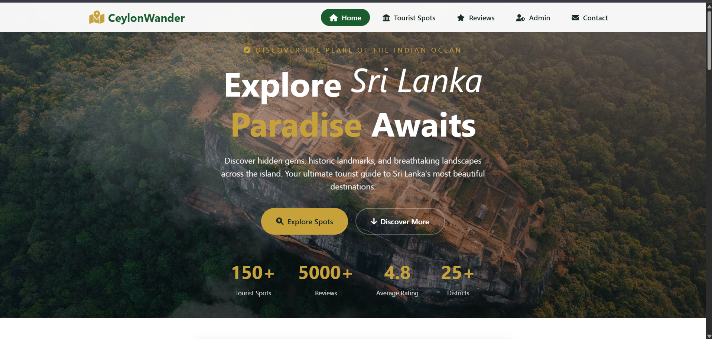
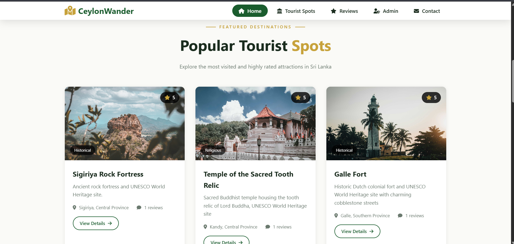

### Tourist Spot Details
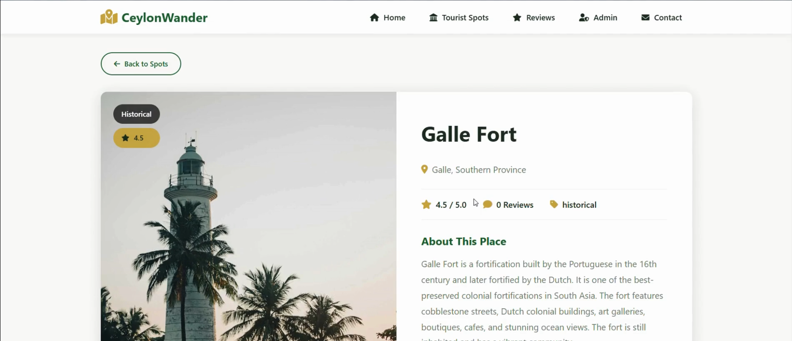

### Reviews
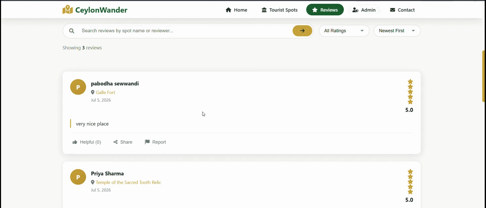
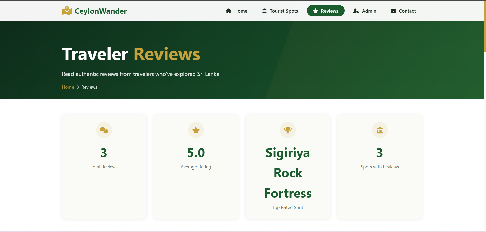

### Admin Panel
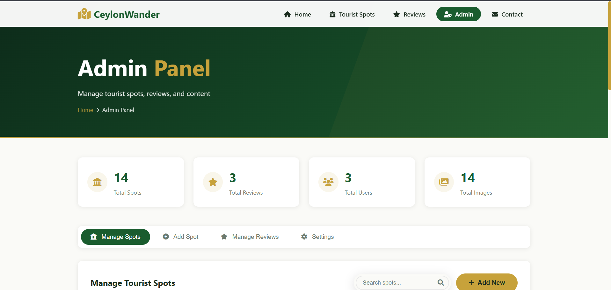
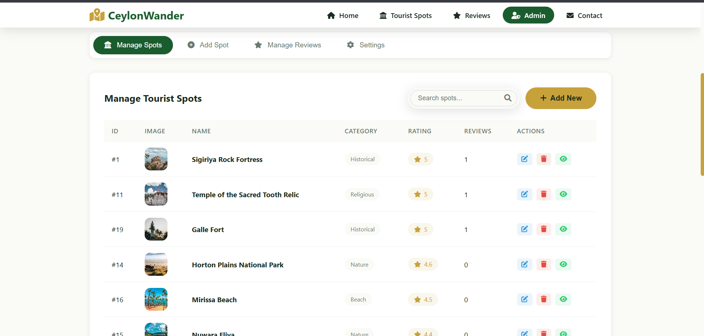

### Azure Deployment
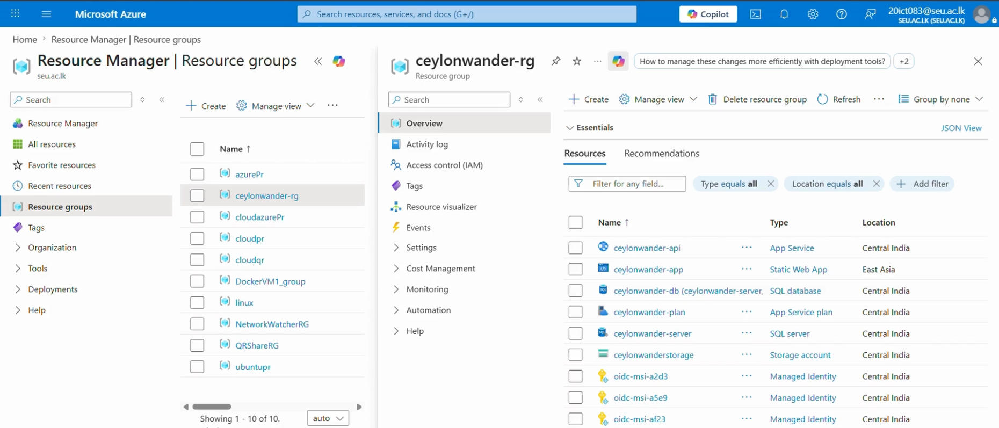
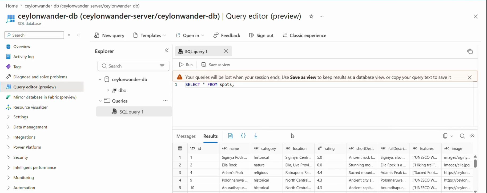
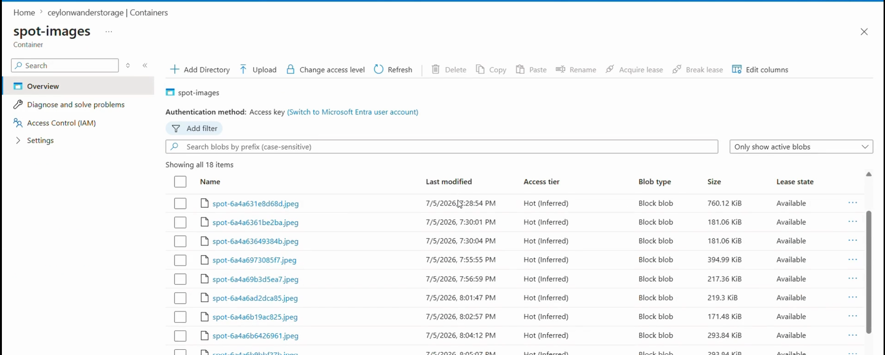
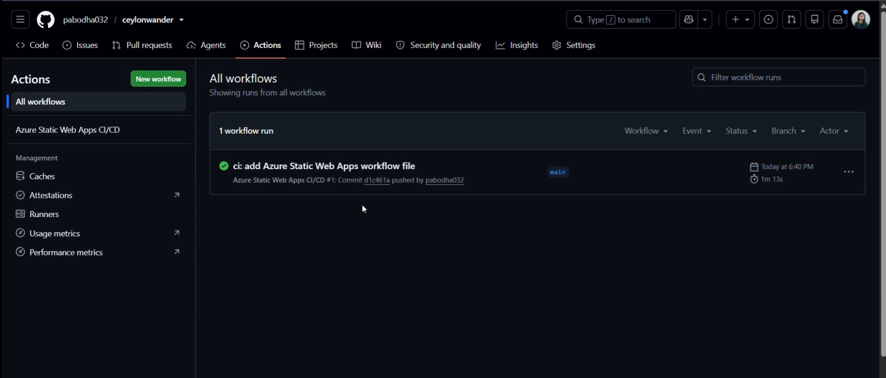

## Deployment

The frontend is deployed on **Azure Static Web Apps**, connected to this repository. Every push to `main` triggers a GitHub Actions workflow that automatically builds and deploys the site.

For backend setup (PHP API, Azure SQL Database schema, Blob Storage configuration), see the [ceylonwander-api](https://github.com/pabodha032/ceylonwander-api) repository.

## Author

**S.M.P. Sewwandi**


---

*Built for the Cloud Application Development module (SWT41042) — Practical Assignment.*
